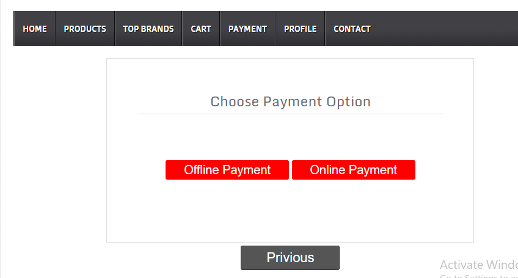

# e-commerce-shop-PHP
online shopping system with admin and user layouts.

## Installation

* Install XAMPP or WAMPP
* open XAMPP Control panel and start [apache] and [mysql]
* Download project form github[ https://github.com/TarekHossain96/e-commerce-shop-PHP.git ]
  
  OR follow gitbash commands

   ```
  1. cd C:\\xampp\htdocs\
  2. git clone https://github.com/TarekHossain96/e-commerce-shop-PHP.git
  ```

* extract files in c:\xampp\htdocs
* open link localhost/phpmyadmin
* give a database name as (db_shop) hit on create button.
* after creating database name click on import.
* browse the file in directory[e-commerce-shop-PHP/config/db_shop.sql].
* after importing successfully.
* open any browser and type http://localhost/e-commerce-shop-PHP/
* for admni panel type http://localhost/e-commerce-shop-PHP/admin/login.php
* admin login details Username=admin and Password=admin@gmail.com.


## Screenshots

> Home page


> Customer login and Registration page

 

> Shopping Cart

 

> Customer payment option 

 

 > Offline Payment and Payment details

 

 > admin panel add product

 

 > admin panel product list

 
 
